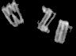
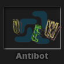
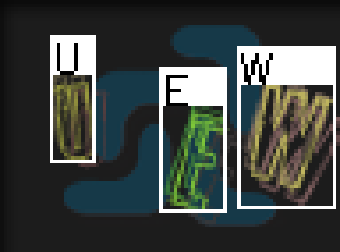
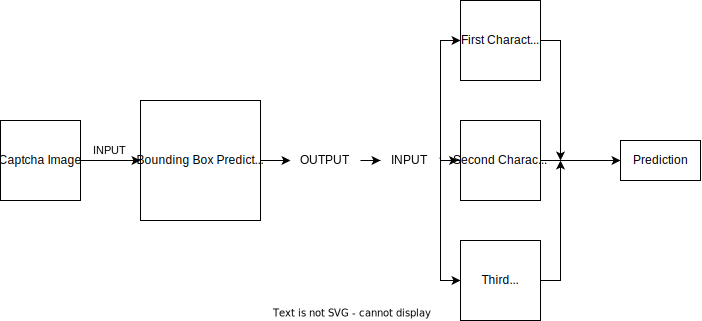
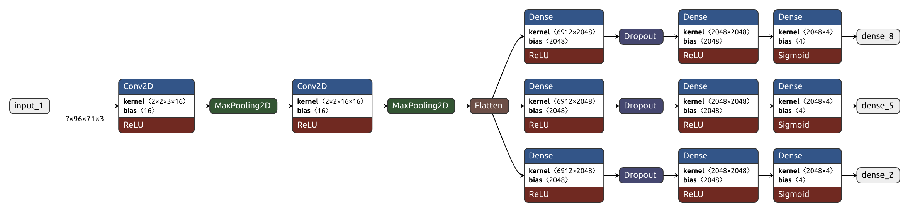
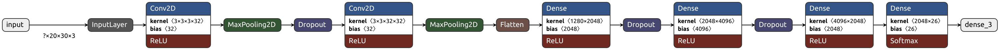

# MH-CaptchaSolver
A custom captcha solver for the webgame called "MafiaensHevn"

Using these two DNN there is no need for preprocessing, no color masking, convolution etc. This is achieved by creating a dataset
where I mask out everything except the characters (using hue color masks), turn it grayscale then apply an algorithm for finding the bounding boxes of each character
with some arbitrary threshold for the minimum area then sending this information to a folder and a bbox.json file.

### Automatically generating dataset
Furthermore, when this is deployed on the website, each captcha it solves is saved to a folder as an image, with the corresponding
bounding box for each characters per image to a .json file.

</img>

## Example Prediction

</img>
</img>
## Pipeline

## Captcha Bounding Box Prediction Model

# Character Prediction Model

